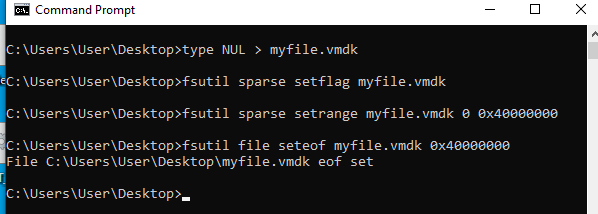
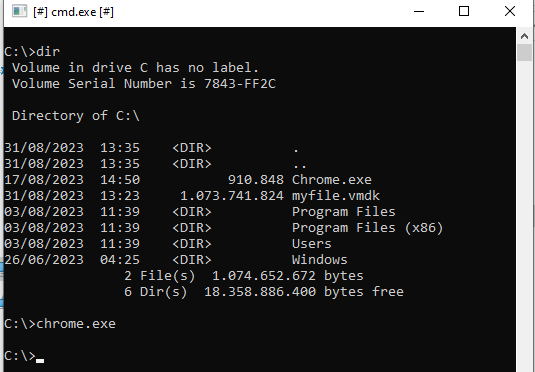
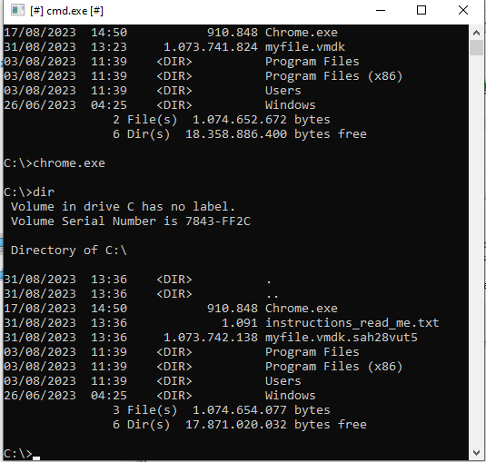
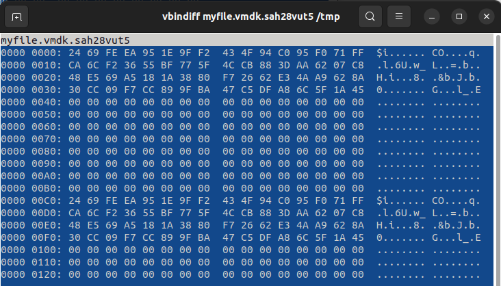
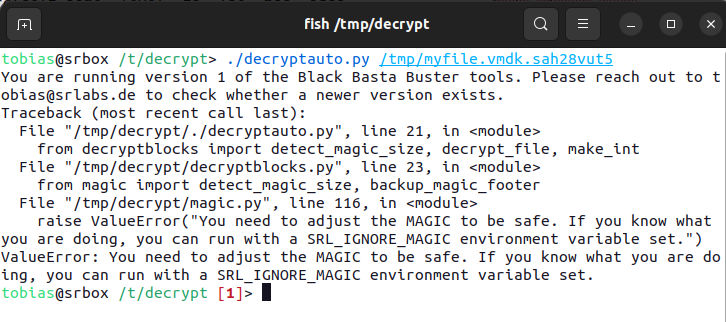
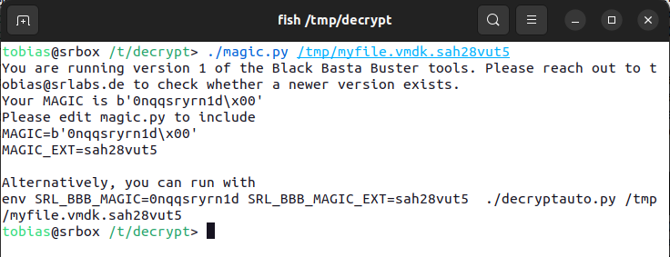
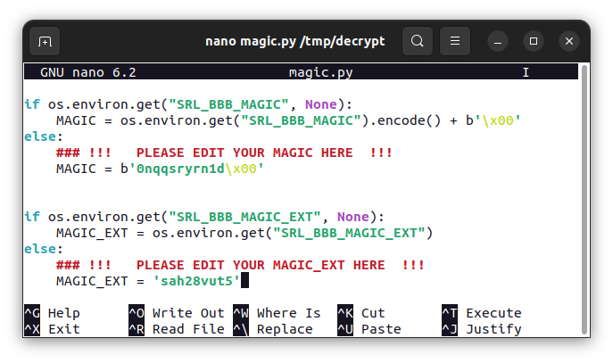
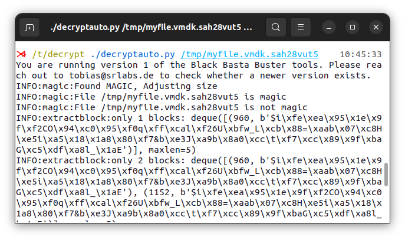
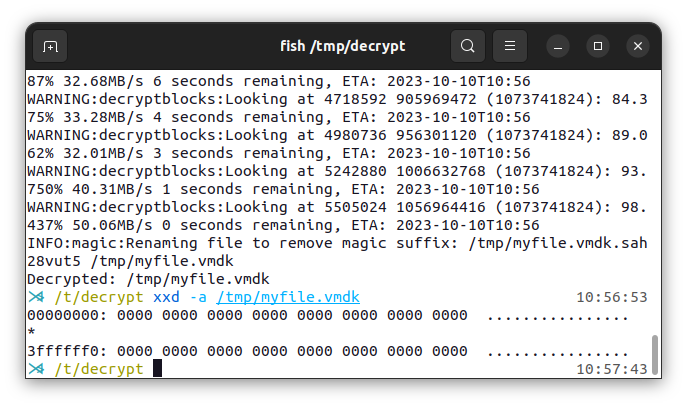
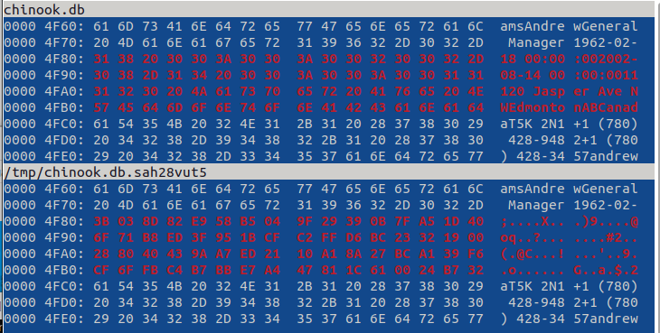

Black Basta Buster
===================

This suite of tools helps decrypting data encrypted with by the Black Basta group.

We looked into the encryption algorithm and have found a particular weakness for the ransomware strain used by Black Basta ransomware around April 2023.

Our analysis suggests that files can be recovered if the plaintext of 64 encrypted bytes is known. Whether a file is fully or partially recoverable depends on the size of the file. Files below the size of 5000 bytes cannot be recovered. For files between 5000 bytes and 1GB in size, full recovery is possible. For files larger than 1GB, the first 5000 bytes will be lost but the remainder can be recovered.

The recovery hinges on knowing the plaintext of 64 encrypted bytes of the file. In other words, knowing 64 bytes is not sufficient in itself since the known plaintext bytes need to be in a location of the file that is subject to encryption based on the malware's logic of determining which parts of the file to encrypt. For certain file types knowing 64 bytes of the plaintext in the right position is feasible, especially virtual machine disk images.

We have built some tooling which can help analyzing encrypted files and check if decryption is possible. For example the ``decryptauto`` tool may recover files containing encrypted zero bytes. Depending on how many times and to what extent the malware encrypted the file, manual review is required to fully recover a file.

A detailed description of our analysis and our finding can be send out on request. We are happy for victims to use our tooling and are happy to answer any question regarding its use. Please get in touch with tobias@srlabs.de.

Contents
----------

* decryptauto.py:

  Probably the most interesting tool. It tries to determine an encrypted zero-block automatically and applies it to the whole file.
  *Attention:* You will need determine your MAGIC, i.e. the discriminator at the end of encrypted files. You can use the ``magic.py`` tool to investigate your encrypted files.

* decryptblocks.py:

  Decrypts a file with a key by XORing the key onto well-known locations within a file

* extractblock.py:

  Extracts a 64 byte long chunk out of a file. This can be useful for taking that block as an encryption key.

* findblocks.py:

  Finds a (small) chunk in a (large) file and prints the positions of the chunk's occurence. This can be useful to determine the first occurence of a block in a file, e.g. by running with a pipe: ``findblocks | head | less``. This first occurrence may then be useful for starting a decryption at a certain offset.

* ranges.py:

  Generates the positions and lengths of encrypted bytes in a file encrypted by the Black Basta ransomware.
 
* readcounter.py:

  Reads the footer of an encrypted file to determine how much of the file has been encrypted. The ransomware leaves a footer in an encrypted file. The footer contains a pointer into the file of how far the en- or decryption has come. This information can be used to determine how quickly the ransomware can en- or decrypt by subsequently reading the footer and measuring how far it has gotten in a certain amount of time. The ``--wait`` switch implements this behaviour.

  Finally, the pointer can be manipulated to the file's size. This can be useful if the en- or decryption is not complete to convince the en- or decrypter about the encrypted ranges of the file. The ``--set-to-size`` switch implements this behaviour.

* vmlsfs.py:

  Helps to execute ``virt-ls`` by arranging its arguments based on a directory's contents. This is useful after having decrypted a VM to see whether the filesystem can be listed.
 
* xorblocks.py:

  XOR a single chunk in a file at a given offset.

Cryptograhic Details
----------------------

The encryption used by the ransomware boils down to a ChaCha keystream
that is used to XOR 64 byte long chunks of the file.
The position of the encrypted blocks is determined by the file size, see ranges.py mentioned above.
Depending on the file size, the ransomware encrypts the first 5000 bytes.

`Zscaler <https://www.zscaler.com/blogs/security-research/back-black-basta>`_ has an analysis of an older version the malware.

Known Plaintext Attack
--------------------------

The keystream, however, is not advanced properly and the same 64 bytes are used for
XORing all the blocks to be encrypted.
This can be observed particularly well when looking at encrypted zero-bytes.
Those encrypted zero-bytes show the very same pattern.
Taking such encrypted zero-bytes and using them to XOR the encrypted chunks allows for a nearly full recovery of the file.

While encrypted zero-bytes work very well for recovering the 64 byte long key required for decryption,
other known plaintexts work as well.
The known plaintext needs to be in an encrypted location, for example, the very first 64 bytes of the file.
Whether the known plaintext is in encrypted locations of the file can be determined through the ``ranges.py`` tool mentioned above.

Caveats
-----------

The keystream is used properly for the first 5000 bytes of the file, depending on its size.
In other words: Those bytes will be lost, except for the very first 64 bytes.

Virtualised disk images, however have a high chance of being recovered, because the actual partitions and their filesystems tend to start later.
So the ransomware destroyed the MBR or GPT partition table, but tools such as "`testdisk <https://www.cgsecurity.org/wiki/TestDisk>`_" can often recover or re-generate those.

Example Session
-------------------

This section demonstrates the usage of the tools located in this repository.

First, we generate a (`sparse <https://superuser.com/a/314319>`_) file for the malware to encrypt::

  type NUL > myfile.vmdk
  fsutil sparse setflag myfile.vmdk
  fsutil sparse setrange myfile.vmdk 0 0x40000000
  fsutil file seteof myfile.vmdk 0x40000000

We should now have a 1GB file full of zeros.

A sample of Black Basta with this weakness can be found `here <https://github.com/keithmcintyre/blackbasta/blob/59dda1b7877588992eaf9084f4f3cfc8cc3c506e/Chrome.exe>`_. We run this malware, maybe with some sandboxing technology such as `Sandboxie <https://sandboxie-plus.com/>`_, to have our file encrypted.

When the malware is finished, we can see that it dropped a ``instructions_read_me.txt`` file and changed the extension of our file.

Looking at the file with a hex editor shows the vulnerable pattern of the encryption:

We try to decrypt the file with the ``decryptauto.py`` tool:

The malware leaves a magic byte sequence in the end which is not part of the encrypted file. Our tools adjust the final file size if the magic byte sequence is detected. If such adjustment is not needed, the tool can be run with the indicated environment variable. But since knowing the exact size of the plaintext file is required for knowing where exactly the malware applied encryption onto the file, we obtain the magic bytes and make them known by editing ``magic.py``.

We also provide the file extension of the encrypted file. This, again, is convenience and, strictly speaking, not required.

Now, the decryption works without raising an error:

After the tool has run, the file contains zero-bytes only. The file has thus been decrypted successfully.

Decrypting without zero-bytes
------------------------------

This example demonstrates how to decrypt a file when the plaintext 64 encrypted bytes are known, for example, because a backup contains an older version. Yet, obtaining the newer version that got encrypted is valuable. This scenario is relevant for files which get mostly appended to, such as databases.

First, we prepare a database for demonstration purposes::

  wget -O- https://raw.githubusercontent.com/lerocha/chinook-database/master/ChinookDatabase/DataSources/Chinook_Sqlite.sql | sqlite chinook.db

Then, we have the file encrypted as before.

We can see a difference between the plaintext file and the encrypted file at offset ``0x4F80``:

We extract the plaintext block at that location into the ``plaintext.block`` file::

	$ ./extractblock.py --hexdump --output=plaintext.block chinook.db 0x4F80
	You are running version 1 of the Black Basta Buster tools. Please reach out to tobias@srlabs.de to check whether a newer version exists.
	INFO:magic:File chinook.db is not magic
	00000000: 31 38 20 30 30 3A 30 30  3A 30 30 32 30 30 32 2D  18 00:00:002002-
	00000010: 30 38 2D 31 34 20 30 30  3A 30 30 3A 30 30 31 31  08-14 00:00:0011
	00000020: 31 32 30 20 4A 61 73 70  65 72 20 41 76 65 20 4E  120 Jasper Ave N
	00000030: 57 45 64 6D 6F 6E 74 6F  6E 41 42 43 61 6E 61 64  WEdmontonABCanad
	$ 

We obtain the keystream bytes into the ``key.block`` file by XORing the plaintext with the ciphertext at our chosen offset::

	$ ./xorblocks.py --output=key.block  /tmp/chinook.db.sah28vut5 ./plaintext.block 0x4F80
	You are running version 1 of the Black Basta Buster tools. Please reach out to tobias@srlabs.de to check whether a newer version exists.
	Null:
	00000000: 31 38 20 30 30 3A 30 30  3A 30 30 32 30 30 32 2D  18 00:00:002002-
	00000010: 30 38 2D 31 34 20 30 30  3A 30 30 3A 30 30 31 31  08-14 00:00:0011
	00000020: 31 32 30 20 4A 61 73 70  65 72 20 41 76 65 20 4E  120 Jasper Ave N
	00000030: 57 45 64 6D 6F 6E 74 6F  6E 41 42 43 61 6E 61 64  WEdmontonABCanad
	Original:
	00000000: 3B 03 8D 82 E9 58 B5 04  9F 29 39 0B 7F A5 1D 40  ;....X...)9....@
	00000010: 6F 71 B8 ED 3F 95 1B CF  C2 FF D6 BC 23 32 19 00  oq..?.......#2..
	00000020: 28 80 40 43 9A A7 ED 21  10 A1 8A 27 BC A1 39 F6  (.@C...!...'..9.
	00000030: CF 6F FB C4 B7 BB E7 A4  47 81 1C 61 00 24 B7 32  .o......G..a.$.2
	Result:
	00000000: 0A 3B AD B2 D9 62 85 34  A5 19 09 39 4F 95 2F 6D  .;...b.4...9O./m
	00000010: 5F 49 95 DC 0B B5 2B FF  F8 CF E6 86 13 02 28 31  _I....+.......(1
	00000020: 19 B2 70 63 D0 C6 9E 51  75 D3 AA 66 CA C4 19 B8  ..pc...Qu..f....
	00000030: 98 2A 9F A9 D8 D5 93 CB  29 C0 5E 22 61 4A D6 56  .*......).^"aJ.V
	$

We can now apply the keystream onto the file to decrypt it::

	./decryptblocks.py /tmp/chinook.db.sah28vut5 ./key.block 

And indeed, the file has been decrypted successfully::

	sha256sum chinook.db /tmp/chinook.db.sah28vut5 
	0528db5461b7b5d5f4ee9e88dd65eebf487fb4c427766b2fe9f7452feeff71e2  chinook.db
	0528db5461b7b5d5f4ee9e88dd65eebf487fb4c427766b2fe9f7452feeff71e2  /tmp/chinook.db.sah28vut5

